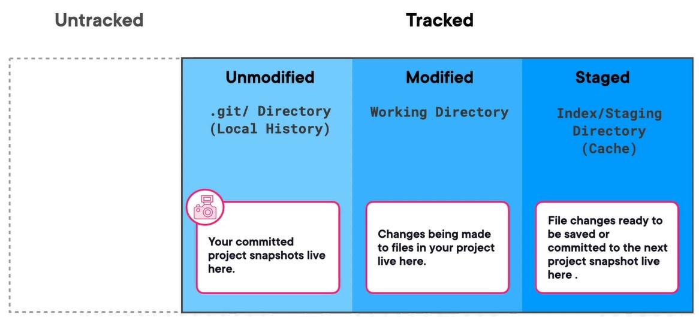

# Git notes 

### File stages
 - Untracked (not added to the list of files to track yet)
 - Tracked (added to the list of files)
    - Unmodified (saved but not changed)
    - Modified (changed but not staged)
    - Staged (staged and ready to push) 

### Directories
 - ./git (the local history of saved unmodified files)
 - Working directory (changes made to saved files live here)
 - Index/staging, sometimes reffered to as the cache (file changes ready to be commited to the next project snapshot lives here)